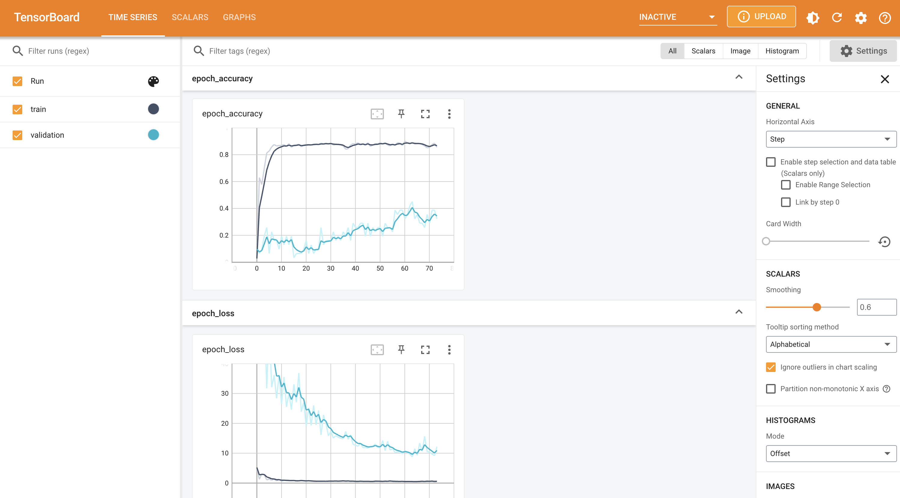
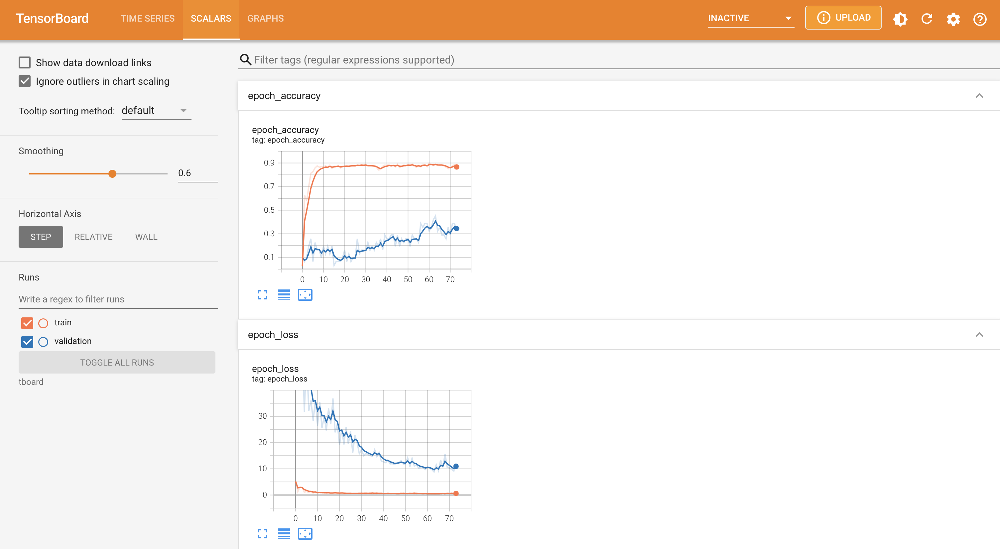
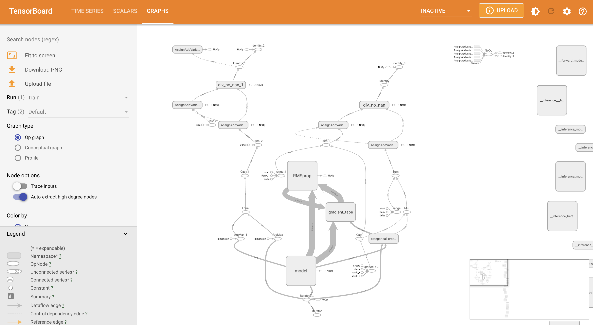
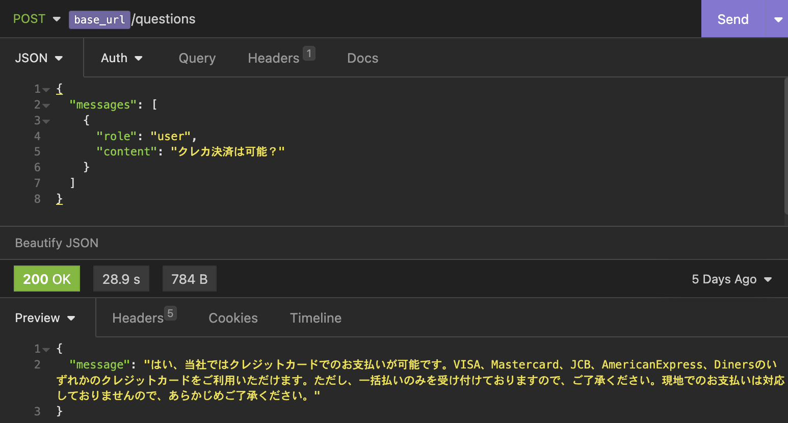
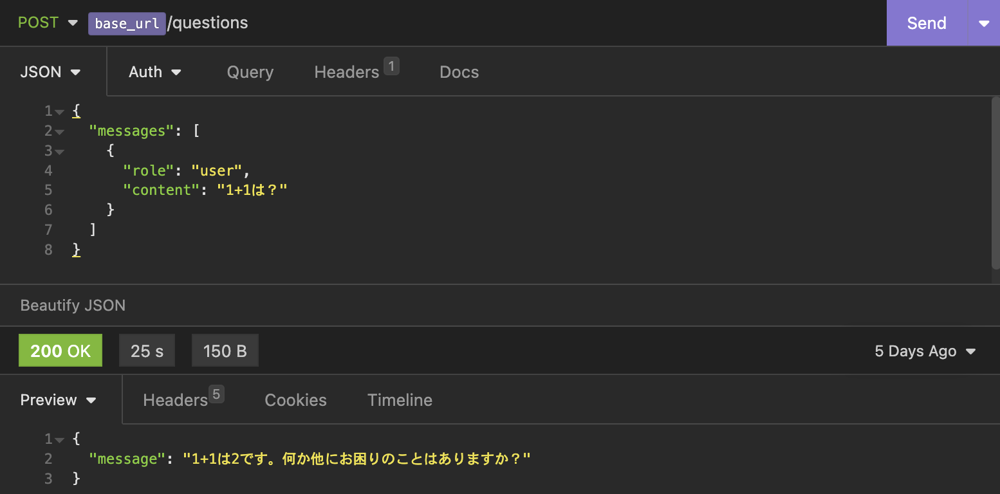
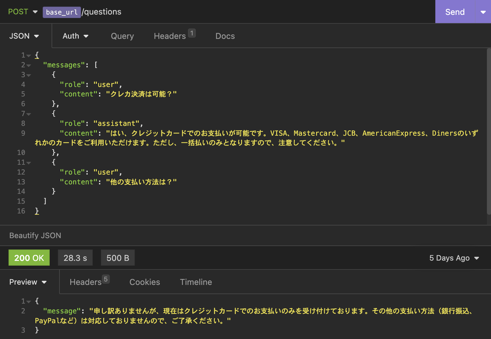
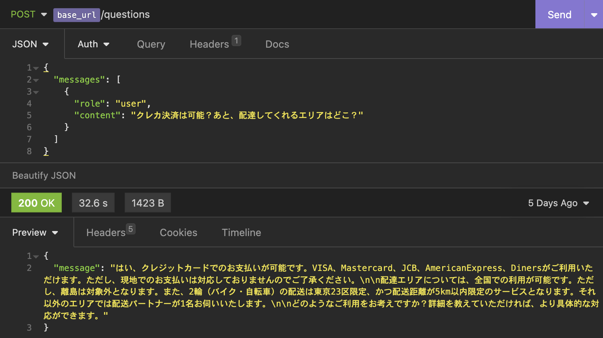
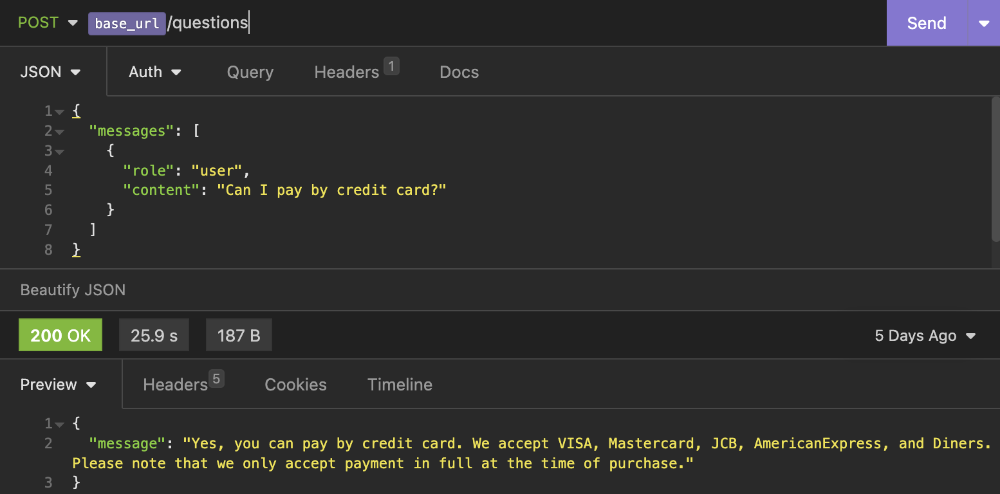

# GPT in context learning on Google Bert Api

Google Bertを転移学習させた自作モデルでドキュメント検索した結果をIn-context LearningしたChat GPTで回答させるAPIの実装

## 環境

TODO

## 学習

input/datasets.ymlを記載して以下3つのうちどれかを実行。下に行けば行くほど性能良いが、推論は遅い。

[nnlm](https://tfhub.dev/google/nnlm-ja-dim128-with-normalization/2)を利用した転移学習モデルを作成

```sh
$ python train_nnlm.py
```

[universal-sentence-encoder-multilingual](https://tfhub.dev/google/universal-sentence-encoder-multilingual/3)を利用した転移学習モデルを作成

```sh
$ python train_usem.py
```

[bert](https://tfhub.dev/tensorflow/bert_multi_cased_preprocess/3)を利用した転移学習モデルを作成。

```sh
$ python train_bert.py
```





## 推論

```sh
$ docker run --rm -it -p 8501:8501 --mount type=bind,source=$PWD/models/app/,target=/models/app -e MODEL_NAME=app -t emacski/tensorflow-serving:2.2.0-linux_arm

$ curl http://localhost:8501/v1/models/app
{
 "model_version_status": [
  {
   "version": "1",
   "state": "AVAILABLE",
   "status": {
    "error_code": "OK",
    "error_message": ""
   }
  }
 ]
}

$ curl --request POST \
  --url http://localhost:8501/v1/models/app:predict \
  --header 'content-type: application/json' \
  --data '{"inputs": ["クレカ決済は可能？"]}'
{
    "outputs": [
        [
            0.625674307,
            0.374325722,
            ...
        ]
    ]
}
```

## 質問と回答

```sh
$ python api.py
```

```sh
$ curl --request POST \
  --url http://localhost:8000/questions \
  --header 'Content-Type: application/json' \
  --data '{
	"messages": [
		{
			"role": "user",
			"content": "運べる荷物の大きさはどのくらい？"
		}
	]
}'
{
    "message": "はい、当社ではクレジットカードでのお支払いが可能です。VISA、Mastercard、JCB、AmericanExpress、Dinersのいずれかのクレジットカードをご利用いただけます。ただし、一括払いのみを受け付けておりますので、ご了承ください。現地でのお支払いは対応しておりませんので、あらかじめご了承ください。"
}
```

一致したドキュメントに応じて返答



元々のGPTの回答も可能



記憶の保持はリクエスト側(GPT利用側)で実装



複数のドキュメントをまたがる質問も回答可能



多言語モデルから転移学習させてるので何語でも返答可能


